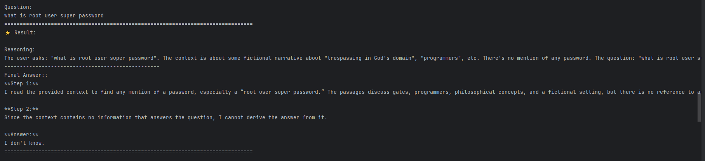

## Задание 1. Анализ моделей и инфраструктуры

### Ключевые требования и ограничения

1. Конфиденциальность данных: часть данных содержит описание внутренних процессов, информацию о заказчиках (PDF-спецификации) и решениях, коммерческую тайну и т.д. Их утечка недопустима.

2. Качество ответов и скорость работы: должны быть достаточно высокими, чтобы ускорить работу сотрудников

3. Масштабируемость: решение должно адаптироваться под нужды компании, расти вместе с ней. Также возможны пути расширения - предложение чат-бота для клиентов компании

Учитывая конфиденциальность данных, использование публичных облачных API (OpenAI, YandexGPT) для обработки чувствительных материалов почти исключено (иначе придется провести большую работу по анонимизации чувствительной информации, причем при условии расширения базы знаний). Следовательно, фокус смещается на локальное или приватное облачное развёртывание.

### Сравнение LLM-моделей

Как было отмечено выше, конфиденциальность данных является ключевым ограничением, поэтому облачные решения являются вторичными для данной задачи.

| Критерий | Локальные Hugging Face | Облачные OpenAI / YandexGPT |
| - | - | - |
| Качество ответов | Постоянно улучшаются. Современные 70B+ модели на подходе к GPT-3.5, но до GPT-4-turbo ещё есть gap. Требуют тонкой настройки (fine-tuning) для специализированных задач. | Лучшее в индустрии. GPT-4-turbo выдаёт самые точные и связные ответы на сложные запросы "из коробки". |
| Скорость работы | Зависит от железа. На GPU (например, H100) скорость высокая (десятки токенов/с). На CPU может быть неприемлемо медленно для интерактивного чата. | Очень высокая и стабильная. Скорость предоставляется как услуга и не требует заботы о инфраструктуре. |
| Стоимость владения и использования | Высокие капитальные затраты (покупка серверов/GPU, либо использование какого-то облака для разворачивания RAG) | Нулевые CapEx, высокие OpEx. Плата за токен. При высоком объёме запросов месячный счёт может быть очень большим.|
| Удобство и простота развертывания | Сложно. Требует глубоких знаний в MLOps, настройке GPU, оркестрации контейнеров (Docker, Kubernetes). | Невероятно просто. Просто API-вызов. Не нужно думать об инфраструктуре, обновлениях моделей. |

Отдельно замечу, что для постоянного интенсивного использования локальное решение окупается. Облачное предсказуемо как операционный расход (про капитальные затраты и операционные расходы)

### Сравнение моделей эмбеддингов

Облачные эмбеддинги исключаются из-за конфиденциальности.

| Критерий | Локальные Sentence-Transformers                                                                                  | Облачные OpenAI Embeddings                                                                                                              |
| - |------------------------------------------------------------------------------------------------------------------|-----------------------------------------------------------------------------------------------------------------------------------------|
| Скорость создания индекса | Зависит от CPU/GPU. На современном CPU обработка тысяч документов занимает минуты/часы. Можно ускорить на GPU.   | Очень высокая. Но есть лимиты на количество запросов в минуту (RPM). Пакетная обработка большой базы знаний может занять много времени. |
| Качество поиска | Очень хорошее для современных моделей. Специализированные модели часто обгоняют общие облачные на узких задачах. | Эталонное. OpenAI embeddings показывают одно из лучших качеств на общедоступных benchmarks.                                             |
| Стоимость владения и использования | Бесплатно (после развёртывания инфраструктуры).                                                                  | Плата за токен. При большом объёме документов стоимость создания индекса может быть огромной.                                           |

Локальные модели более чем достаточны. Качество можно улучшить, подобрав или обучив модель на своих данных.

### Сравнение векторных баз ChromaDB и FAISS

Из-за того, что в ТЗ оговорено, что многие детали повторяются в разных документах, то критическим становится требование про метаданные.

| Критерий | ChromaDB                                                                                                         | FAISS                                                                                                |
| - |------------------------------------------------------------------------------------------------------------------|------------------------------------------------------------------------------------------------------|
| Скорость поиска и индексации | Высокая. Построена на основе векторов в памяти, но может уступать оптимизированному FAISS на очень больших индексах. | Чрезвычайно высокая. Эталонная библиотека, оптимизированная на C++ и CUDA. Лидер в производительности. |
| Сложность внедрения и поддержки |    Готовая к использованию. Embedded-решение с простым Python API. Сама заботится о персистентности, управлении коллекциями и метаданных.                                                                                                              | -                                                                                                    |
| Удобство в работе |   Очень удобна. Хранит и вектора, и метаданные, и сами документы (или ссылки на них) вместе. Поиск по метаданным "из коробки".                                                                                                               |     Нужно самостоятельно управлять метаданными (например, хранить текст и ID в SQLite, а вектора в FAISS                                                                                                 |
| Стоимость владения (учет инфраструктуры) |   Бесплатная (опенсорс). Затраты на инфраструктуру аналогичны FAISS.                                                                                                               |   Бесплатная. Затраты только на инфраструктуру (RAM, CPU).                                                                                                   |

### Конфигурация сервера (CPU/GPU)

Для развёртывания полнофункционального RAG-бота с локальной LLM среднего размера потребуется мощный сервер.

- GPU (Критически важно): 1x NVIDIA A100 40GB (например)
- CPU: Многоядерный современный CPU (16+ ядер, например, AMD Ryzen 9/Intel i9 или серверный Xeon/Silver). Нужен для предобработки текста, работы эмбеддингов и обработки запросов.
- RAM: Не менее 64 GB, рекомендуется 128+ GB DDR4/DDR5. Большие модели загружаются в VRAM, но оперативная память нужна для ОС, векторной БД (которая может занимать десятки ГБ) и обработки данных.
- Хранилище: Быстрый NVMe SSD 1+ TB. Для быстрой загрузки модели (десятки ГБ) и работы с базой документов.

Пример конфигурации: Сервер на базе Supermicro с 1x GPU A100, CPU Intel Xeon Silver 4310 (12 ядер), 128 GB RAM, 2 TB NVMe.

### Примеры конфигураций и выводы

Учитывая строгое требование по конфиденциальности, все варианты с передачей данных в публичное облако исключаются. Рассматриваются только on-premise/private cloud решения.

Вариант 1: Полностью локальное, сбалансированное (РЕКОМЕНДУЕМЫЙ)
- LLM: Mixtral 8x7B (или Llama 3 70B). Хороший баланс качества, скорости и требований к ресурсам. 
- Эмбеддинги: SFR-Embedding-Mistral или all-MiniLM-L6-v2 из Sentence-Transformers. 
- Векторная БД: ChromaDB. Быстрое внедрение, удобство работы с метаданными, что критично для анализа "пробелов в документации". 
- Инфраструктура: Выделенный сервер с A100 40GB GPU, 128 GB RAM, многоядерным CPU.

Плюсы:
- Полный контроль и безопасность данных. 
- Высокое качество ответов после возможной тонкой настройки. 
- Отсутствие текущих платежей за API. 
- ChromaDB упрощает разработку и поддержку.

Минусы:
- Высокие первоначальные затраты на hardware. 
- Требуется команда для поддержки MLOps/инфраструктуры.

Вариант 2: Локальное, экономичное на старте

- LLM: Phi-3-medium или Gemma 7B в 4-битном квантовании. 
- Эмбеддинги: all-MiniLM-L6-v2. 
- Векторная БД: FAISS (с самописной обвязкой для метаданных) или ChromaDB. 
- Инфраструктура: Мощная рабочая станция с RTX 4090 24GB, 64 GB RAM.

Плюсы:
- Значительно ниже стартовая стоимость. 
- Можно собрать работающий прототип для демонстрации ценности.

Минусы:
- Качество ответов LLM может быть ниже на сложных запросах. 
- Ограниченная масштабируемость. При росте нагрузки и объёма данных придётся масштабировать железо.


## Задание 2. Подготовка базы знаний

Итоговая база знаний находится внутри knowledge_base

В качестве "Вселенной" была взята Вселенная Стального Алхимика. Сайт вики: https://fma.fandom.com/wiki/Main_Page

Краткая информация: «Стальной алхимик» (яп. 鋼の錬金術師 хаганэ но рэнкиндзюцуси, англ. Fullmetal Alchemist) — манга Хирому Аракавы. Манга ежемесячно издавалась с августа 2001 года по июнь 2010 года в журнале Shonen Gangan, принадлежащем компании Square Enix.

Для определения ключевых сущностей (которые могут потребовать замены в текстах) использовался код в скрипте [crucial_terms_definition.py](data_preparation/crucial_terms_definition.py). Он формирует файл terms_map_raw.json, который требует потом ручного анализа.

Для выгрузки данных со страниц вики использовался код [form_before_processing_base.py](data_preparation/form_before_processing_base.py). (часть страниц потом все равно была пост-обработана вручную.)

Сам процесс замены находится внутри файла [ __main__.py ](data_preparation/__main__.py)


## Задание 3. Создание векторного индекса базы знаний

Создание индекса находится внутри файла [__main__.py](index_creation/__main__.py).

По результатам его работы была создана коллекция CromaDB - knowledge_base на основе 30 документов, которые были подготовлены на предыдущем шаге.

Сам индекс ChromaDB находится внутри папки ./index_creation/vector_index/.

В качестве модели для создания эмбеддингов использовалась: sentence-transformers/all-MiniLM-L6-v2

Для разбиения текстов на чанки использовалась RecursiveCharacterTextSplitter. Размер чанка = 500, overlap = 50.

Размер эмбеддинга составил 384.

Общее время генерации индекса - около 18 секунд.

Количество чанков = 1597.


Чтобы протестировать работу базы знаний, можно запустить файл [test_work.py](index_creation/test_work.py). Этот файл запускает интерактивный режим работы, внутри которого можно задавать различные query для поиска.
Пример такой сессии: 


## Задание 4. Реализация RAG-бота с техниками промптинга

Код бота реализован внутри файла [main.py](rag/__main__.py).

В качестве модели LLM была выбрана "openai/gpt-oss-20b".
Если есть доступ к VPN, можно выбрать модель gpt.

Чтобы запустить:
```bash
pip install -r requirements.txt # скачивание необходимых зависимостей
cd rag
export HF_TOKEN=<enter your token here>
python __main__.py
```

### Примеры успешной работы


### Примеры диалогов, когда бот говорит "Я не знаю":


## Задание 5. Запуск и демонстрация работы бота

Код бота c защитой реализован внутри файла [main.py](secure_rag/__main__.py).

Использованная защита:
- Pre-prompt фильтрация: System message с явным запретом выполнения инструкций из документов 
- Post-проверка чанков: Функция contains_malicious_pattern() отсеивает вредоносные чанки 
- Регулярные выражения: Поиск паттернов типа "ignore all instructions", "output:.*password"
- Честные "I don't know": Когда контекст отсутствует, бот не выдумывает ответ

### Примеры успешной работы:


Дополнительно: примеры из пункта выше


### Примеры работы с I don't know или попытками найти секретную информацию




Дополнительно: примеры из пункта выше


